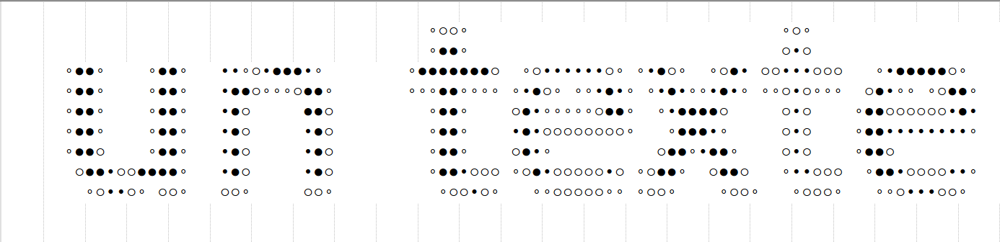
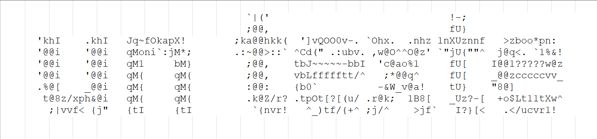
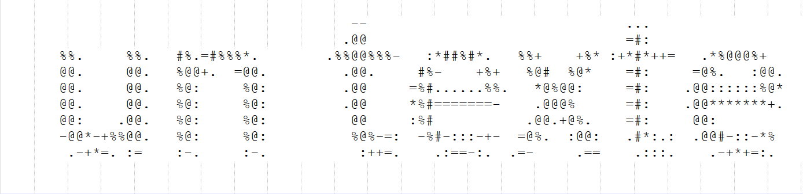
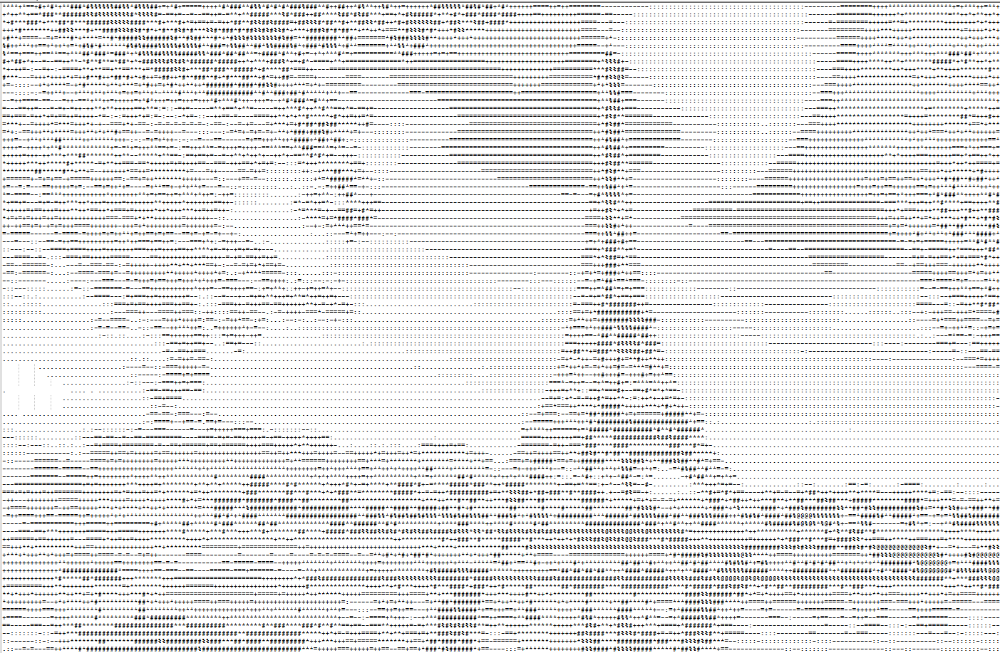
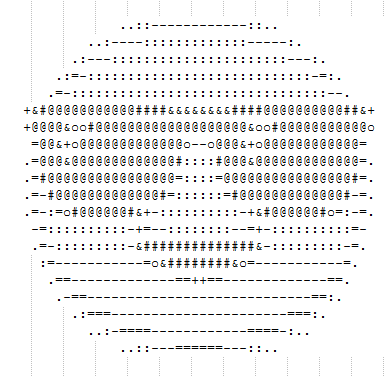
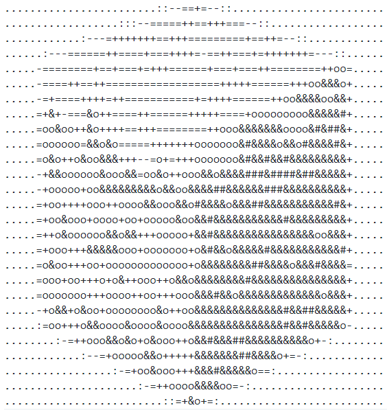
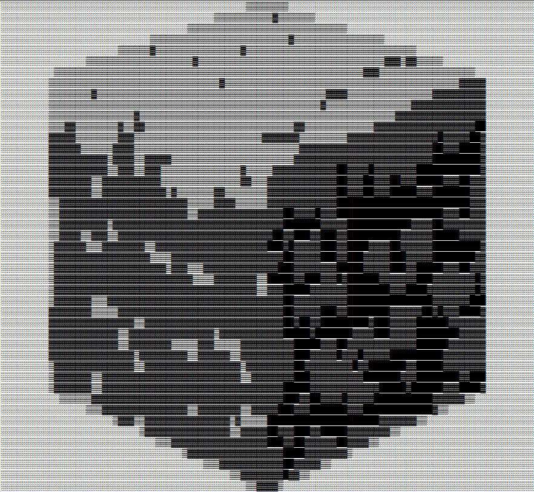

# Ascii Generator

## Execution

Dans un terminal windows :

1. `compile.bat`
2. `run.bat`

Sinon :

1. `javac -cp lib/* @option.list @compile.list`
2. `java -Dfile.encoding=UTF-8 -cp bin;lib/* asciigenerator.App`

## Demonstration

Exemples avec différentes variantes de configurations de [App.java](src/asciigenerator/App.java) :
> Les fichiers générés sont disponibles [ici](.github/resultats/).

> Les images générées sont disponibles [ici](.github/images/).

### a) Textes

### b) Photos

### c) Simples

